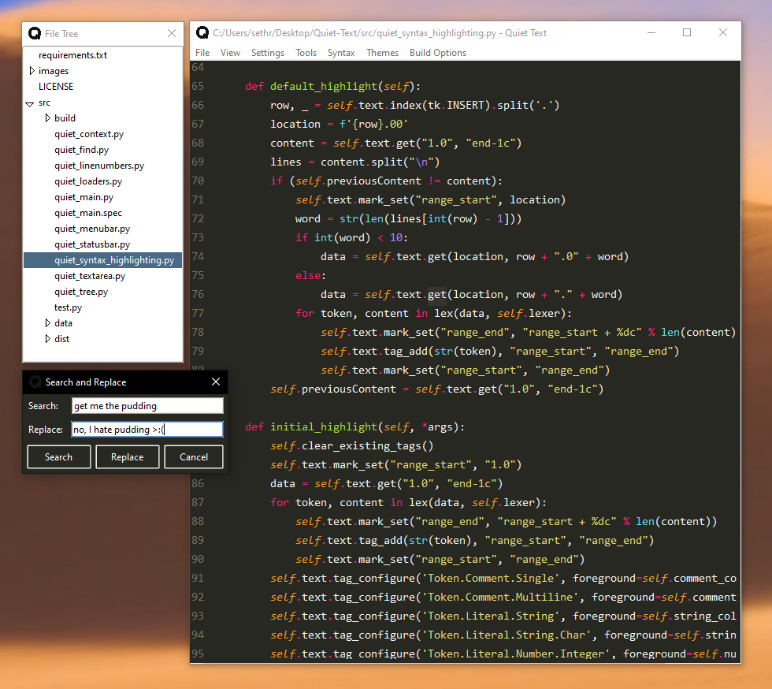

<p align="center">
    
  </a>
</p>

<h2 align="center">Quiet Text</h2>

<p align="center">
   
   
   
   
</p>

<p align="center">
  Quiet Text is a simple, minimalist text editor made with Python's Tkinter GUI library. Quiet Text aims to create a calming and distraction   free text environment for writing code and taking notes.
</p>


(screenshot taken on Ubuntu running Gnome Desktop)

## Table of contents
- [Notable Features](#notable-features)
- [Keyboard Shortcuts and Usage](#keyboard-shortcuts)
- [Quick Start](#quick-start)
- [Installation/Setup](#installation)
- [Contributing](#contributing)

## About

Quiet Text aims to give you a **clean and simple** text editor experience. Everything is right in front of you and all completely customizable to your preferences. Too many text editors clutter their ui with unnecessary tooling that overwhelms their users. It isn't uncommon for somebody to lose hours of their precious work day mulling over and disabling irritating configuration settings in their text editor/ide. We want to eliminate the annoyances of a noisy/busy text editing environment and bring you an environment that has the **main goal of increasing focus and eliminating distractions**.

## Notable Features

- Autocompletion for parenthesis, brackets (square and curly), single quotes, and double quotes.
- Auto indentation for code blocks and brackets (when creating lists or creating functions).
- Syntax highlighting for 11 different languages and more to come (Go, Python, C, C++, Rust, Java, JavaScript, HTML, CSS, Yaml, Markdown).
- Ability to compile and run your code from the editor. 
- 9 different themes and color schemes to chose from (and more to come).
- Customization options like font, text color, line height, and many more. 


## Keyboard Shortcuts


Quiet Text has shortcuts for most commonly performed actions. The list of all the shortcuts is presented bellow:

| Command | KeyBinding | Description |
| ------- | ---------- | ----------- |
| Copy | <kbd>ctrl</kbd>+<kbd>c</kbd> | Copy selected text |
| Cut | <kbd>ctrl</kbd>+<kbd>x</kbd> | Cut selected text |
| Paste | <kbd>ctrl</kbd>+<kbd>v</kbd> | Paste text from the clipboard |
| Bold | <kbd>ctrl</kbd>+<kbd>b</kbd> | Bold selected text |
| Find and Replace | <kbd>ctrl</kbd>+<kbd>f</kbd> | Find and replace specified text |
| Highlight | <kbd>ctrl</kbd>+<kbd>h</kbg> | Highlight selected text |
| Hide Menu | <kbd>alt</kbd> | Hides menu bar from view in the text editor |
| Hide Line Numbers | <kbd>ctrl</kbd>+<kbd>shift</kbd>+<kbd>l</kbd> | Hides line numbers from text area |
| New File | <kbd>ctrl</kbd>+<kbd>n</kbd> | Open a new empty file |
| Load Previous File | <kbd>ctrl</kbd>+<kbd>p</kbd> | Loads the last file you had open |
| Open File | <kbd>ctrl</kbd>+<kbd>o</kbd> | Open an existing file |
| Open File Tree | <kbd>ctrl</kbd>+<kbd>t</kbd> | Opens file tree for seamless work inside a directory |
| Color Menu | <kbd>ctrl</kbd>+<kbd>m</kbd> | Opens color menu |
| Run File | <kbd>ctrl</kbd>+<kbd>r</kbd> | Run the currently active file |
| Save | <kbd>ctrl</kbd>+<kbd>s</kbd> | Save the currently active file |
| Save As | <kbd>ctrl</kbd>+<kbd>shift</kbd>+<kbd>s</kbd> | Save the currently active file under a different name |
| Change Font Size | <kbd>ctrl</kbd>+<kbd>mousewheel</kbd> | Increases or decrease font size |
| Indent | <kbd>tab</kbd> | Indent one or multiple lines |
| Unindent | <kbd>shift</kbd>+<kbd>tab</kbd> | Unindent one or multiple lines |


## Quick Start

### Use the release binaries (.exe)

The fastest way to use the program is to just launch one of the release binaries on your system.
If you are on Linux and the binary is not opening you may need to allow permission first. Type in the following command **if you trust this program**.
On Windows you may run into a similar issue, but the Windows gui will let you "run anyway" if you allow it. 

```sh
chmod u+x (name of .exe file)
```

### Launch using python
The second fastest way would be to install the dependencies through **requirements.txt** and then launch the application through **src/quiet_main.py**.
You can see instructions for this method [below](#installation).

### Create your own binary
If the release binary is not up to date with the current development branch, then you can just create your own binary with **pyinstaller**. I'll walk you through the process real quick.

1. Clone source files off github into your preferred directory
```sh
git clone https://github.com/SethWalkeroo/Quiet-Text.git
```

2. Install pyinstaller
```sh
pip install pyinstaller
```

3. Cd into the src directory and use pyinstaller on quiet_main.py
```sh
pyinstaller --icon=q.png --onefile quiet_main.py
```

4. Edit the quiet_main.spec file to include the projects resource tree (configs, themes, syntax, etc.)


5. Use pyinstaller again on your new quiet_main.spec file

```sh
pyinstaller quiet_main.spec
```

6. Check the dist directory for your binary file and you should be good to go!

(image/gif coming soon)


## Installation
This project requires **Pygments** as well as **PyYAML**. Both of these packages can be installed through a virtual environment with **requirements.txt**.
After you install the dependencies, you can simply head into the **src** directory and launch the editor from **src/quiet_main.py**.

**Mac and Linux installation:**

```sh
python3 -m venv env
```

```sh
source env/bin/activate
```

```sh
pip3 install -r requirements.txt
```
```sh
cd src
```

```sh
python3 quiet_app_launch.py
```

**Windows:**

```sh
python -m venv env
```

```
env\Scripts\activate.bat
```
```
pip install -r requirements.txt
```

```sh
cd src
```

```sh
python3 quiet_main.py
```

This project also requires a Python3 interpreter with Tkinter support.
You can test it using

```sh
python3 -m tkinter
```

In case your (GNU/Linux) machine does not support tkinter, there's a way to run it inside Docker (whereas you can also use another base image than `ubuntu`):

```
FROM ubuntu
RUN apt update && apt install -y python3-tk x11-apps
RUN mkdir /code
WORKDIR /code
ADD . /code
CMD ["/usr/bin/python3", "-m", "quiet"]
```

Now, expose an environment variable to allow access to your host system `XAUTH="$HOME/.Xauthority"` and build the image using `docker build -t quiet .`.
You can start a container using

```sh
docker run --network=host --rm -e DISPLAY=$DISPLAY -v $XAUTH:/root/.Xauthority quiet
```

Be aware, that the Docker container has full access to your machine! So you better trust the executed code.


## <a href="CONTRIBUTING.md">Contributing</a>

* Issues are open to anyone and everyone, but you must comment on the issue first and communicate to me that you are working on it. If you are confident in your ability, I will assign you to the issue. 

* Don't work on an issue that isn't assigned to you unless you communicate with the assignee first. 

* If you make an improvement on an existing feature, make sure to create an issue first and list the fixes or features you have made to the code.

* All PRs must be made from a Branch. Create a separate branch for every Issue you are working upon and once found fit, make a PR.

* Please make sure your code works before you submit it :)

#### check CONTRIBUTING.md for guidlines on how to make a pull request.


## Goals

- [x] Create a visually pleasing text editor! ;)
- [x] Add syntax highlighting for Python.
- [ ] Allow user's to launch the terminal and run their scripts from any platform.
- [ ] Add special markdown for making lists and notetaking.
- [x] Allow full customization of the editor's theme and colors.
- [x] Add helpful features for programming like autoclosing brackets and parenthesis.

#### suggestions are welcome!


