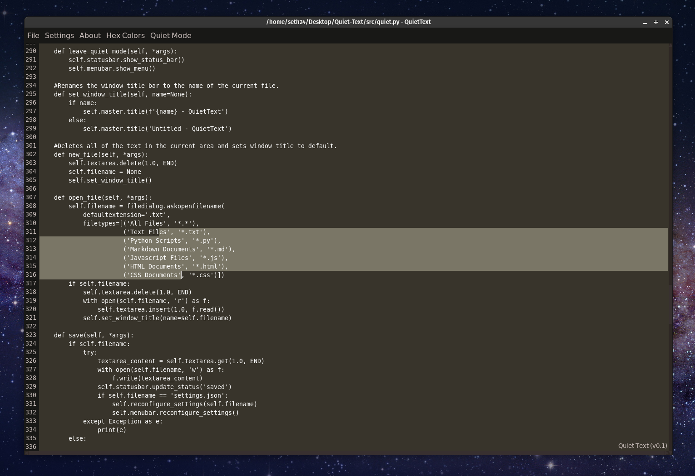

<p align="center">
    
  </a>
</p>

<h2 align="center">Quiet Text</h2>

<p align="center">
   
   
   
   
   <a href="https://www.codacy.com/gh/SethWalkeroo/Quiet-Text/dashboard?utm_source=github.com&amp;utm_medium=referral&amp;utm_content=SethWalkeroo/Quiet-Text&amp;utm_campaign=Badge_Grade"></a>
</p>

<p align="center">
  Quiet Text is a simple, minimalist text editor made with Python's Tkinter GUI library. Quiet Text aims to create a calming and distraction   free text environment for writing code and taking notes.
</p>


# Preview

<p>
  
</p>


## About

Quiet Text aims to give you a **clean and simple** text editor experience. Everything is right in front of you and all completely customizable to your preferences. Too many text editors clutter their ui with unnecessary tooling that overwhelms their users. It isn't uncommon for somebody to lose hours of their precious work day mulling over and disabling irratating configuration settings in their text editor/ide. We want to eliminate the annoyances of a noisy/busy text editing environment and bring you an environment that has the **main goal of increasing focus and eliminating distractions**.


## Table of contents
- [Installation/Setup](#installation)
- [Keyboard Shortcuts](#keyboard-shortcuts)
- [Contributing](#contributing)
- [Contributors](#contributors)


## Installation

This project requires a Python3 interpreter with Tkinter support.
You can test it using

```sh
python3 -m tkinter
```

In case your (GNU/Linux) machine does not support tkinter, there's a way to run it inside Docker (whereas you can also use another base image than `ubuntu`):

```
FROM ubuntu
RUN apt update && apt install -y python3-tk x11-apps
RUN mkdir /code
WORKDIR /code
ADD . /code
CMD ["/usr/bin/python3", "-m", "quiet"]
```

Now, expose an environment variable to allow access to your host system `XAUTH="$HOME/.Xauthority"` and build the image using `docker build -t quiet .`.
You can start a container using

```sh
docker run --network=host --rm -e DISPLAY=$DISPLAY -v $XAUTH:/root/.Xauthority quiet
```

Be aware, that the Docker container has full access to your machine! So you better trust the executed code.


## Keyboard Shortcuts
Quiet Text has shortcuts for most commonly performed actions. The list of all the shortcuts is presented bellow:

| Command | KeyBinding | Description |
| ------- | ---------- | ----------- |
| Copy | <kbd>ctrl</kbd>+<kbd>c</kbd> | Copy selected text |
| Cut | <kbd>ctrl</kbd>+<kbd>x</kbd> | Cut selected text |
| Paste | <kbd>ctrl</kbd>+<kbd>v</kbd> | Paste text from the clipboard |
| Bold | <kbd>ctrl</kbd>+<kbd>b</kbd> | Bold selected text |
| Highlight | <kbd>ctrl</kbd>+<kbd>h</kbg> | Highlight selected text |
| New File | <kbd>ctrl</kbd>+<kbd>n</kbd> | Open a new empty file |
| Open File | <kbd>ctrl</kbd>+<kbd>o</kbd> | Open an existing file |
| Color Menu | <kbd>ctrl</kbd>+<kbd>m</kbd> | Opens color menu |
| Run File | <kbd>ctrl</kbd>+<kbd>r</kbd> | Run the currently active file |
| Save | <kbd>ctrl</kbd>+<kbd>s</kbd> | Save the currently active file |
| Save As | <kbd>ctrl</kbd>+<kbd>shift</kbd>+<kbd>s</kbd> | Save the currently active file under a different name |
| Change Font Size | <kbd>ctrl</kbd>+<kbd>mousewheel</kbd> | Increases or decrease font size |


## <a href="CONTRIBUTING.md">Contributing</a>

* Issues are open to anyone and everyone, but you must comment on the issue first and communicate to me that you are working on it. If you are confident in your ability, I will assign you to the issue. 

* Don't work on an issue that isn't assigned to you unless you communicate with the assignee first. 

* If you make an improvement on an existing feature, make sure to create an issue first and list the fixes or features you have made to the code.

* All PRs must be made from a Branch. Create a separate branch for every Issue you are working upon and once found fit, make a PR.

* Please make sure your code works before you submit it :)

#### check CONTRIBUTING.md for guidlines on how to make a pull request.


## Goals

- [x] Create a visually pleasing text editor! ;)
- [ ] Add syntax highlighting for Python.
- [ ] Allow user's to launch the terminal and run their scripts from any platform.
- [ ] Add special markdown for making lists and notetaking.
- [ ] Allow full customization of the editor's theme and colors.
- [ ] Add helpful features for programming like autoclosing brackets and parenthesis.

#### suggestions are welcome!


## Contributors

Thanks goes to these wonderful people!:

<!-- ALL-CONTRIBUTORS-LIST:START - Do not remove or modify this section -->
<!-- prettier-ignore-start -->
<!-- markdownlint-disable -->
<table>
  <tr>
    <td align="center"><a href="https://github.com/SethWalkeroo"><br /><sub><b>Seth Walker</b></sub></a><br /><a href="https://github.com/SethWalkeroo/Quiet-Text/commits?author=SethWalkeroo" title="Code">💻</a> <a href="https://github.com/SethWalkeroo/Quiet-Text/commits?author=SethWalkeroo" title="Documentation">📖</a> <a href="https://github.com/SethWalkeroo/Quiet-Text/issues?q=author%3ASethWalkeroo" title="Bug reports">🐛</a> <a href="#content-SethWalkeroo" title="Content">🖋</a> <a href="#design-SethWalkeroo" title="Design">🎨</a></td>
    <td align="center"><a href="https://sid200026.github.io/"><br /><sub><b>Siddharth Singha Roy</b></sub></a><br /><a href="https://github.com/SethWalkeroo/Quiet-Text/issues?q=author%3ASid200026" title="Bug reports">🐛</a></td>
    <td align="center"><a href="https://github.com/thainapires"><br /><sub><b>Thainá Pires</b></sub></a><br /><a href="https://github.com/SethWalkeroo/Quiet-Text/commits?author=thainapires" title="Documentation">📖</a></td>
    <td align="center"><a href="https://github.com/Thanarathanam"><br /><sub><b>Thanarathanam Lakshmanan</b></sub></a><br /><a href="https://github.com/SethWalkeroo/Quiet-Text/commits?author=Thanarathanam" title="Code">💻</a></td>
    <td align="center"><a href="https://punidramesh.tech"><br /><sub><b>Punid Ramesh</b></sub></a><br /><a href="https://github.com/SethWalkeroo/Quiet-Text/commits?author=punidramesh" title="Code">💻</a></td>
    <td align="center"><a href="https://github.com/Ryuno-Ki"><br /><sub><b>André Jaenisch</b></sub></a><br /><a href="https://github.com/SethWalkeroo/Quiet-Text/commits?author=Ryuno-Ki" title="Code">💻</a> <a href="https://github.com/SethWalkeroo/Quiet-Text/commits?author=Ryuno-Ki" title="Documentation">📖</a></td>
    <td align="center"><a href="https://github.com/aish0007"><br /><sub><b>aish0007</b></sub></a><br /><a href="https://github.com/SethWalkeroo/Quiet-Text/commits?author=aish0007" title="Documentation">📖</a></td>
  </tr>
  <tr>
    <td align="center"><a href="https://github.com/hrishikesharma"><br /><sub><b>HRISHIKESH  SARMA</b></sub></a><br /><a href="https://github.com/SethWalkeroo/Quiet-Text/commits?author=hrishikesharma" title="Code">💻</a></td>
    <td align="center"><a href="https://github.com/JuliusChrona"><br /><sub><b>Kirill Vackevich</b></sub></a><br /><a href="https://github.com/SethWalkeroo/Quiet-Text/commits?author=JuliusChrona" title="Code">💻</a></td>
  </tr>
</table>

<!-- markdownlint-restore -->
<!-- prettier-ignore-end -->

<!-- ALL-CONTRIBUTORS-LIST:END -->

This project follows the [all-contributors](https://github.com/all-contributors/all-contributors) specification. Contributions of any kind welcome!
